## 0.线路连接

!!! warning "警告"

    接线过程中请勿带电操作，会对您的人身安全的造成损害。

    详细对照接线图进行接线，尤其注意供电线路，接线错误会造成不可逆的电器损坏。

!!! info "接线图"
    点击查看完整[<strong>接线图</strong>]。
    [<strong>接线图</strong>]: jxt.pdf

    {.img1}

## 1.接线说明

### 开关电源

1.电源开关线：
   {.img1}

2.接线说明：
   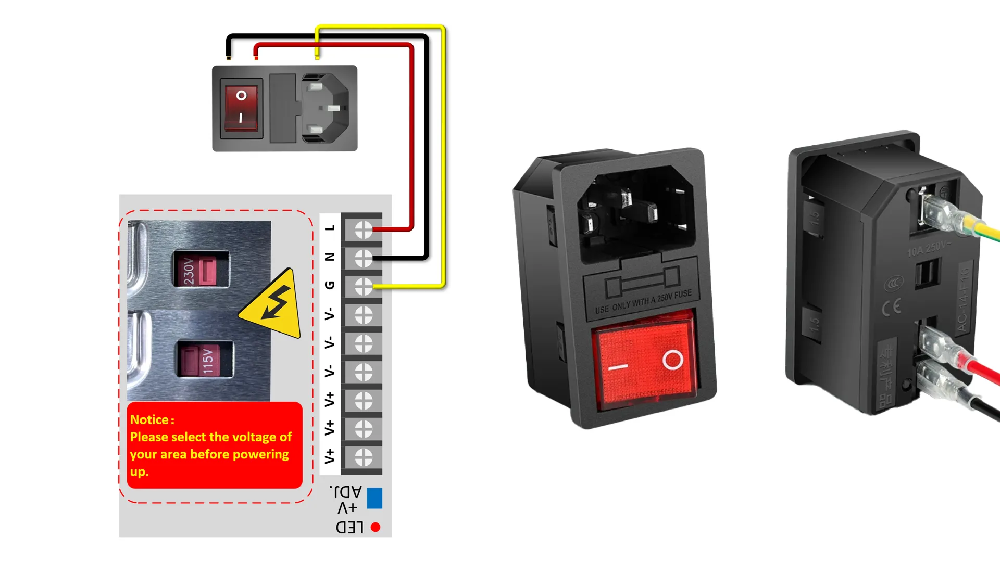{.img1}

### 耐高温线

1.耐高温线：
   {.img1}

2.接线说明：
   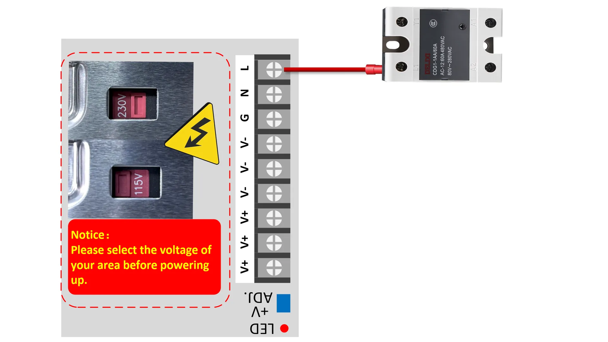{.img1}

### 粗红黑线

1.粗红黑线：
   {.img1}

2.接线说明：
   {.img1}

### 细红黑线

1.细红黑线：
   {.img1}

2.接线说明：
   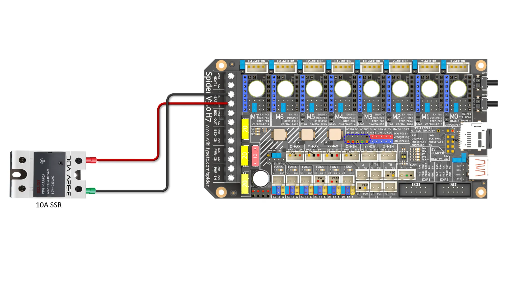{.img1}

### TYPE-C线

1.TYPE-C线：
   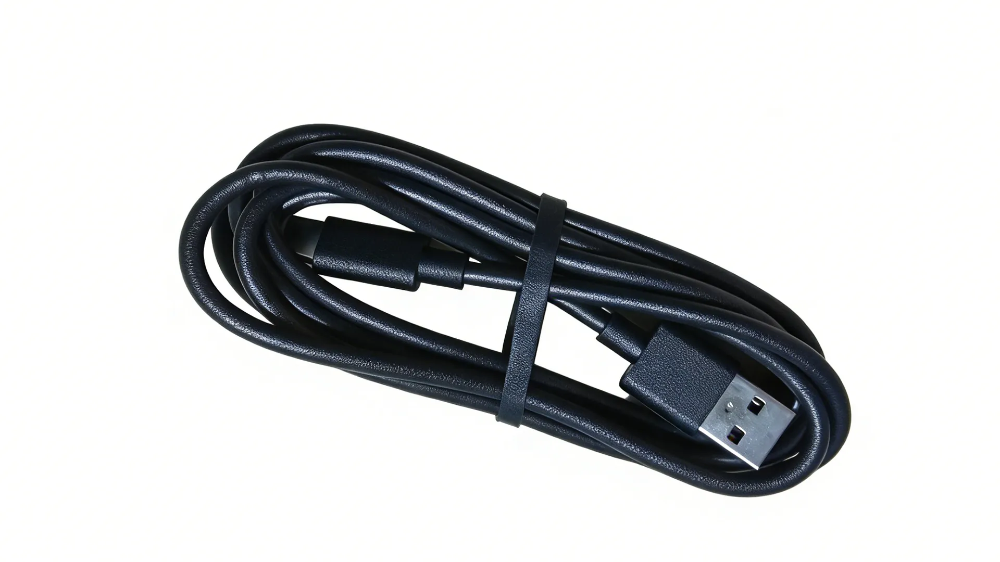{.img1}

2.接线说明：
   {.img1}

## 2.线材整理

### 所需物料

1.扎带
   {.img1}

### 打印零件

1.[2020型材卡扣]
[2020型材卡扣]: dy1.stl
   {.img1}

2.[3030型材卡扣]
[3030型材卡扣]: dy2.stl
   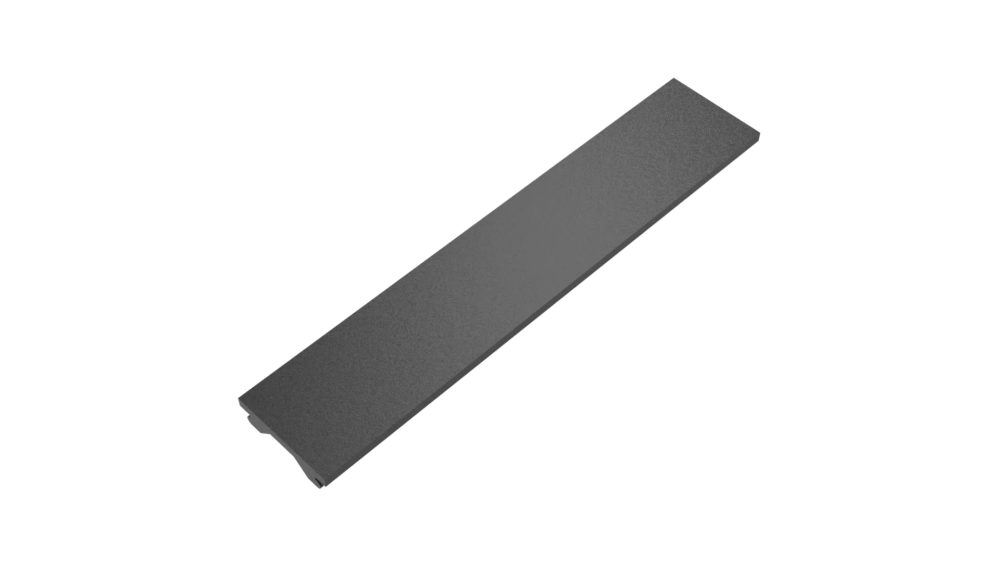{.img1}

### 组装流程

1.将<strong>热床</strong>卡入<strong>后侧热床挡板</strong>的凹槽中，进行接线操作，使用<strong>扎带</strong>整理线材并剪去多余部分,如图所示。
   {.img1}

2.将线穿过<strong>下脚件装饰件</strong>过线孔中并从上拉出，再穿入<strong>下脚件装饰件</strong>过线孔中并从<strong>步进电机</strong>处拉出，如图所示。
   {.img1}
   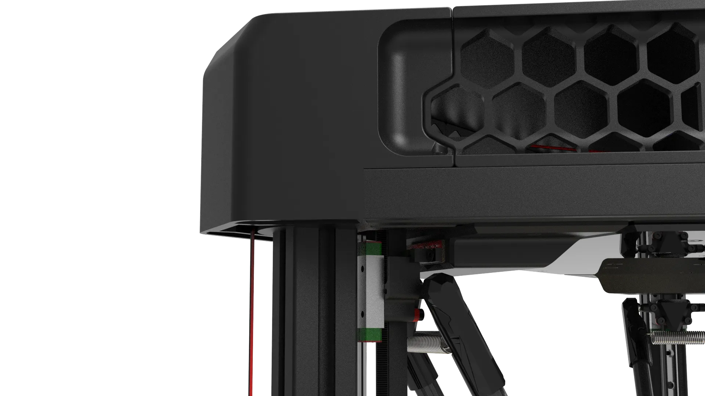{.img1}

3.使用<strong>3030型材卡扣</strong>将线卡入到<strong>长铝型材</strong>上，如图所示。
   {.img1}
   {.img1}

3.使用<strong>2020型材卡扣</strong>将线卡入到<strong>长铝型材</strong>上，如图所示。
   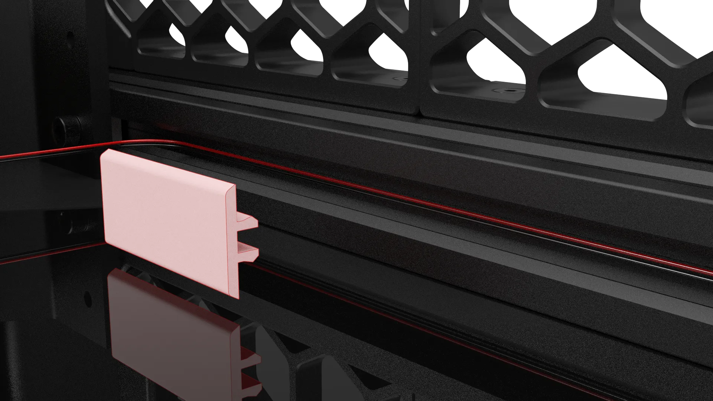{.img1}
   {.img1}
   {.img1}

!!! info "打印数量"
    <strong>3030型材卡扣</strong>与<strong>2020型材卡扣</strong>的打印数量与长度根据喜好决定，一般线材不杂乱即可，可在切片软件中根据自己理线需求，修改打印文件件的长度。

## 3.挡边组装

### 所需物料

1.M4*10 杯头螺丝 * 24
   {.img1}

2.船型螺母30型-M4 * 24
   {.img1}

### 打印零件

1.[上下挡边] * 6
   [上下挡边]: dy3.stl
   {.img1}

2.[中间挡边] * 6
   [中间挡边]: dy4.stl
   {.img1}

### 组装流程

1.将<strong>上下挡边</strong>与<strong>中间挡边</strong>进行扣合，注意此结构为榫卯结构，圆形卡扣需全部卡入圆形凹槽中，如图所示。
   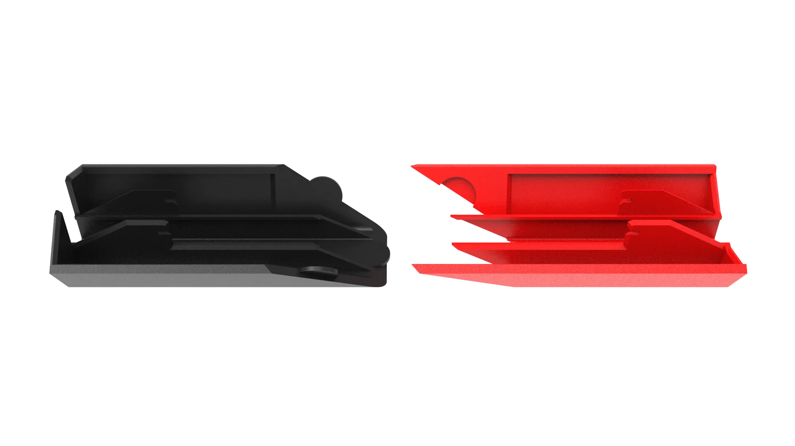{.img1}
   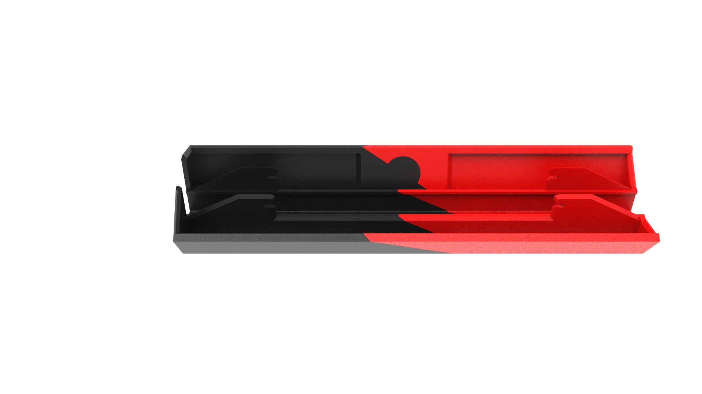{.img1}
   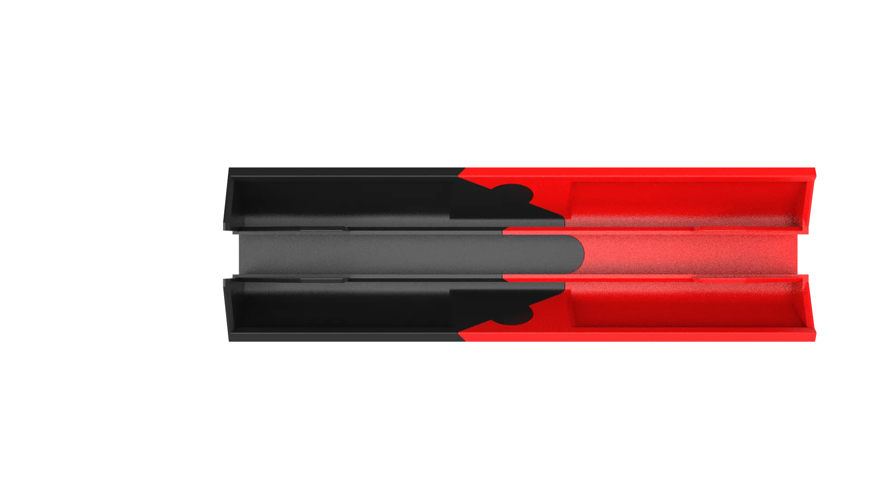{.img1}

2.使用相同方法再扣合一组，如图所示摆放。
   {.img1}

3.扣入到<strong>长铝型材</strong>中，如图所示。
   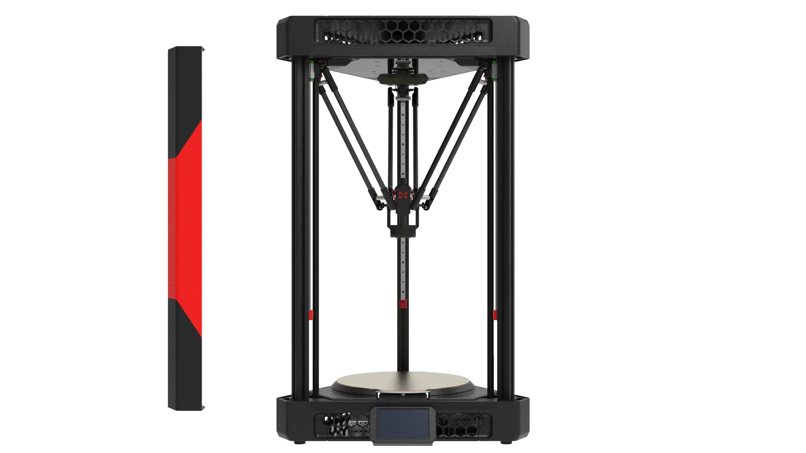{.img1}
   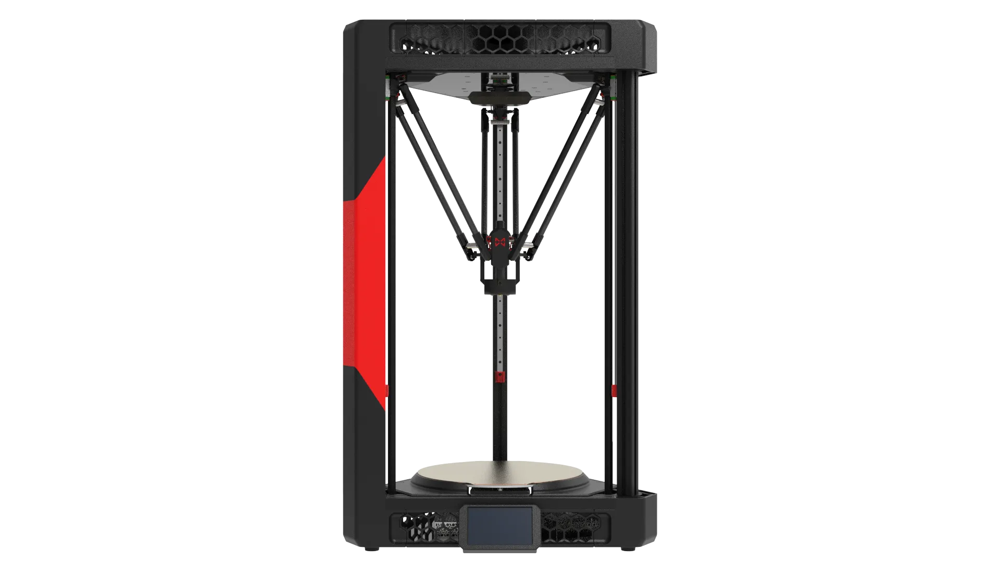{.img1}

3.将<strong>M4*10 杯头螺丝</strong>拧入<strong>船型螺母30型-M4</strong>，不要拧紧，拧上即可，如图所示。
   {.img1}

4.将螺丝放入<strong>长铝型材</strong>的卡槽中，向下滑动螺丝使能卡入<strong>上下挡边</strong>的槽中，拧好螺丝，如图所示。
   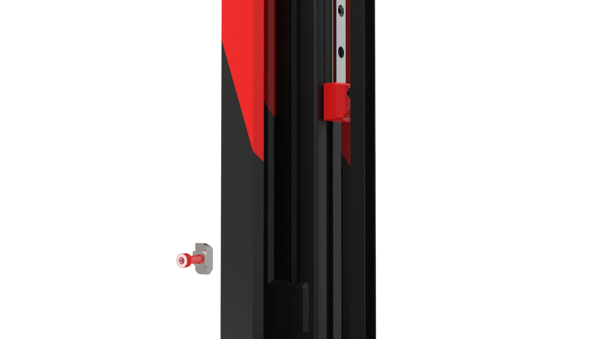{.img1}
   {.img1}
   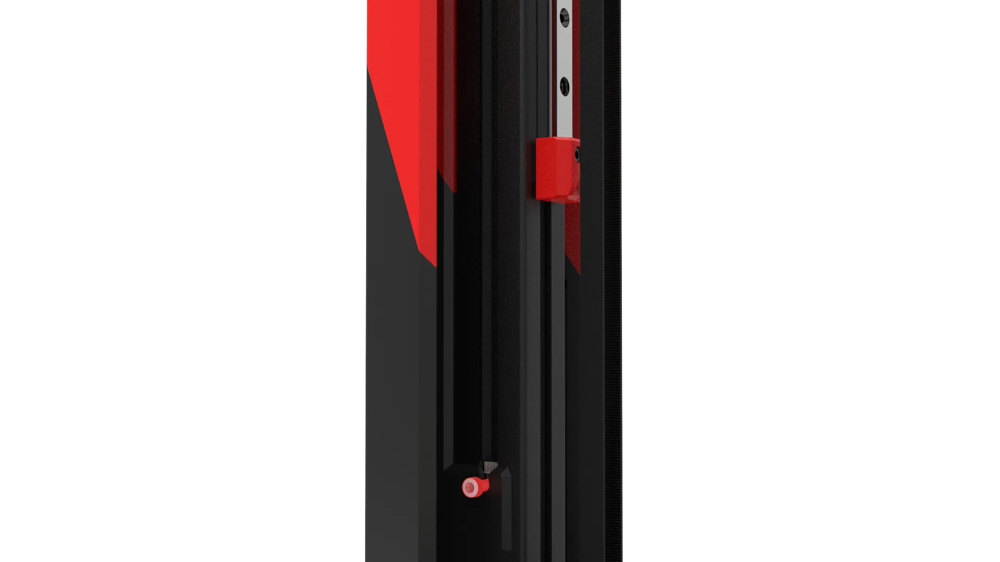{.img1}
   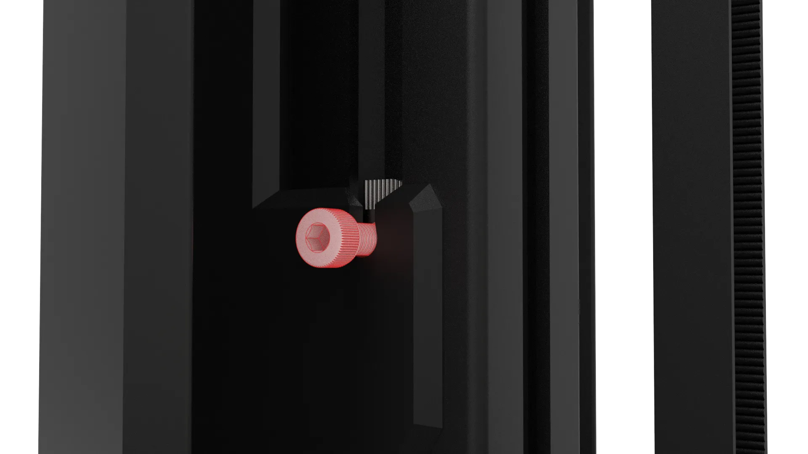{.img1}
   {.img1}

!!! warning "注意"
    注意<strong>船型螺母40型-M4</strong>的位置，应卡在<strong>长型材的</strong>凹槽内，不要拧的过紧，以免拧坏打印件。
       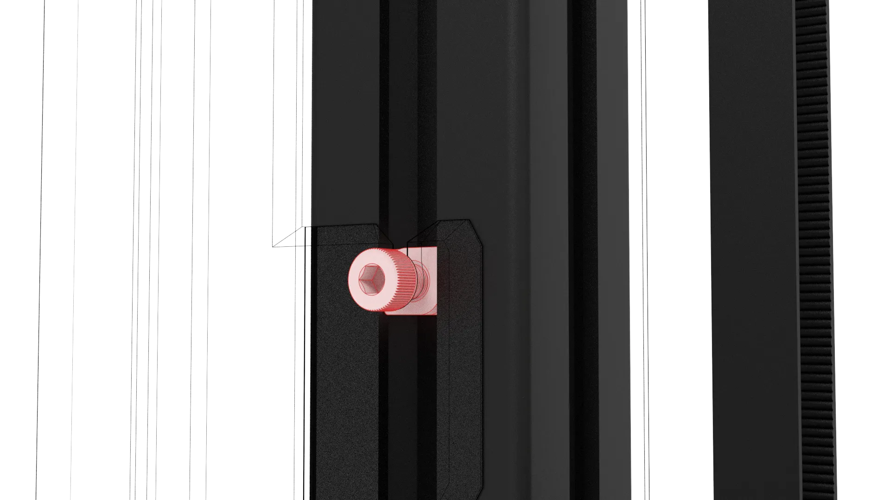{.img1}

5.相同方法，螺丝放入<strong>长铝型材</strong>的卡槽中，向上滑动螺丝使能卡入<strong>中间挡边</strong>的槽中，拧好螺丝，如图所示。
   {.img1}

!!! warning "注意"
    注意<strong>船型螺母40型-M4</strong>的位置，应卡在<strong>长型材的</strong>凹槽内，不要拧的过紧，以免拧坏打印件。
       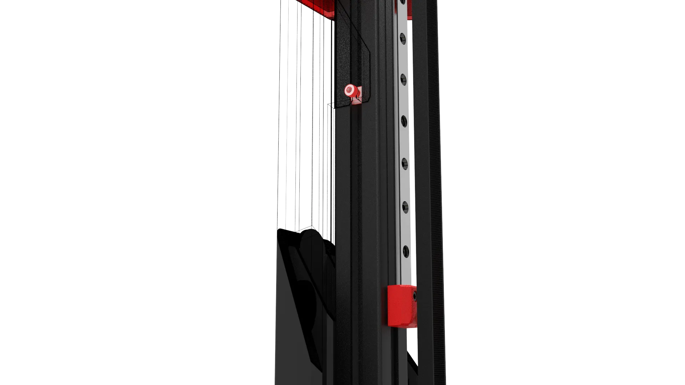{.img1}

5.另外两颗螺丝安装方法相同，如图所示。
   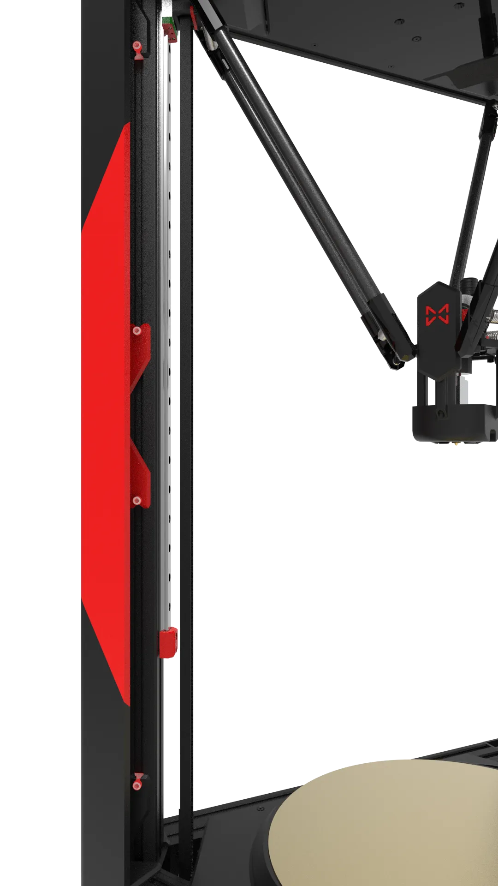{.img1}

6.另外一边安装方法相同，如图所示。
   {.img1}

7.另外两组安装相同，如图所示。
   {.img1}